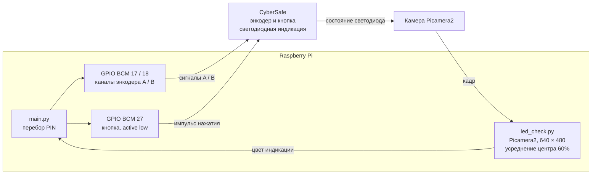

# Вектор 2. Автоматизированный перебор PIN

**Статус: подтверждён на физическом устройстве.**

## 1. Цель

Проверить, можно ли автоматизировать ввод PIN на устройстве CyberSafe и обнаружить успешную попытку по пользовательской индикации.

## 2. Стенд и условия

- Физическое устройство CyberSafe.
- Raspberry Pi, управляющий стендом и имитирующий вращение/нажатия энкодера.
- Камера, направленная на интерфейс устройства для контроля его состояния.

### Управляющие скрипты

- [`main.py`](../evidence/scripts/main.py) задаёт GPIO BCM 17 и 18 для каналов A/B энкодера, а BCM 27 — для кнопки. Кнопка управляется активным низким уровнем; после каждой попытки скрипт ожидает красную или зелёную индикацию и останавливается на зелёной.
- [`led_check.py`](../evidence/scripts/led_check.py) получает кадры Picamera2 размером 640 × 480, усредняет центральную область размером 60% кадра и классифицирует её цвет как красный, зелёный, синий или неопределённый.

### Функциональная схема стенда

Схема отражает назначение GPIO и программный поток, заданные в исходниках. Физическая распайка проводов, модель Raspberry Pi и камеры, версии библиотек и параметры запуска, использовавшиеся в конкретной видеозаписи, не зафиксированы. Скрипты анализируют кадры для определения цвета, но не записывают видеофайл; видеозапись эксперимента является отдельным доказательством.

## 3. Методика

1. Установить устройство и камеру так, чтобы светодиодная индикация оставалась видимой на протяжении всего эксперимента.
2. Подключить Raspberry Pi к стенду имитации ввода энкодером.
3. Запустить управляющую программу, подающую последовательности ввода PIN.
4. Использовать изменение индикации устройства как признак результата проверки.
5. Остановить перебор после обнаружения успешного ввода и зафиксировать результат на видео.

### Параметры воспроизведения по исходникам

Следующие значения сняты непосредственно из приложенных скриптов. Это параметры текущей версии кода
| Параметр | Значение в исходниках |
| --- | --- |
| Режим GPIO | BCM; каналы A/B энкодера — GPIO 17/18, кнопка — GPIO 27 |
| Начальное состояние каналов A/B | `LOW, LOW` (`IDLE_HIGH = False`) |
| Управление энкодером | Четырёхфазная последовательность; увеличение цифры выполняется вращением против часовой стрелки |
| Кнопка | Активный низкий уровень; пауза перед нажатием 150 мс, нажатие 100 мс, отпускание 150 мс |
| Задержка на состояние энкодера | 25 мс на каждую фазу последовательности |
| Пауза между попытками | 1,2 с после ввода и проверки PIN |
| Диапазон кода | Старт `0000`; верхняя граница задаётся вторым аргументом, по умолчанию `9999`, включительно. Первый аргумент читается, но не применяется |
| Камера | Picamera2, конфигурация кадра `640 × 480`, формат `RGB888`; задержка после запуска камеры 0,5 с |
| Область анализа | Центральные 60% ширины и высоты кадра; перед классификацией каналы кадра меняются местами, затем берётся среднее RGB по области |
| Ожидание результата | Опрос каждые 50 мс, максимум 6 с; красный считается неуспехом, зелёный — успехом, при успехе программа останавливается |
| Классификатор цвета | Минимальная насыщенность 25%, яркость 20%; красный: hue ≤ 20° или ≥ 340°; зелёный: 80–<170°; синий: 200–<280°; прочее — `none` |
| Зависимости по импортам | `RPi.GPIO`, `picamera2`, `numpy`; версии в репозитории не зафиксированы |

## 4. Результат

Автоматизированный перебор выполнен на физическом устройстве и занял **около 8 часов**. Пароль, открывший доступ к хранилищу, - `3459`

## 5. Видеодоказательство

Видеозапись размещена на Google Drive

**Видео:** [Открыть запись перебора PIN в Google Drive](https://drive.google.com/file/d/1nKdqRTAGpSUCG8hbRdTu2GWFtVgMZdNv/view?usp=sharing)

## 6. Прочие материалы

- Скрипты Raspberry Pi: [`main.py`](../evidence/scripts/main.py) и [`led_check.py`](../evidence/scripts/led_check.py).
- Фото стенда с Raspberry Pi: [открыть снимок](../evidence/photos/photo_2026-09-29_00-54-24.jpg).
- Фотографии устройства: [каталог доказательств](../evidence/photos/).
- Дамп, использованный для анализа PIN: [`dump.bin`](../evidence/artifacts/dump.bin). Его SHA-256 указан в [манифесте](../evidence/SHA256SUMS.txt).
- Контекст исследования и статус остальных направлений: [общий доклад](../report.md).

## 7. Итог

Автоматизированный перебор PIN Raspberry Pi с видеоконтролем выполнен на физическом CyberSafe примерно за 8 часов. Видеодоказательство доступно по ссылке Google Drive выше.
