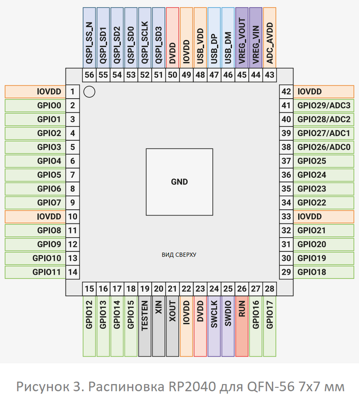
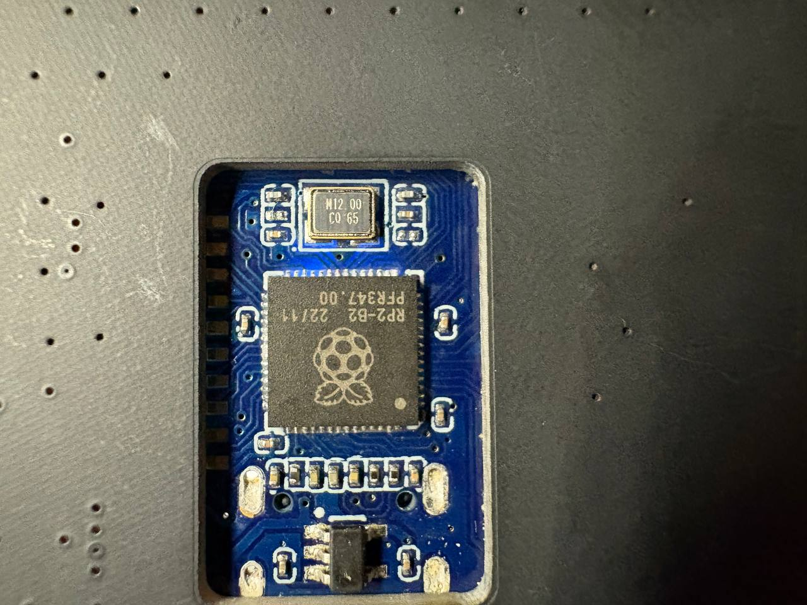

# Вектор 4. Подключение к отладочному интерфейсу SWD

**Статус: гипотеза; практическая проверка не проводилась.**

## 1. Цель предполагаемой проверки

Установить, доступны ли линии SWD микроконтроллера RP2040 на конкретном экземпляре устройства и позволяет ли отладчик установить воспроизводимую сессию чтения или управления.

## 2. Предполагаемый сценарий

Для отладки RP2040 обычно используются линии SWDIO и SWCLK. Проверяемая гипотеза состоит в том, что физический доступ к этим линиям позволит подключить совместимый отладчик. Наличие поддержки SWD микроконтроллером не доказывает, что линии разведены на удобные площадки, что они доступны на собранной плате или что отладочная сессия будет успешной.

### Распиновка и фото устройства

Справочная распиновка RP2040 показывает расположение выводов микроконтроллера и помогает определить SWDIO/SWCLK. Фотографии ниже документируют установленное устройство и отсутствие отдельного отладочного разъёма на показанных участках платы.

По фотографиям видно, что отладочные пины не вывеведены на плате. Для доступа к отладочному интерфейсу треубется прямое подклбючение к ним.

## 3. Статус и причина отсутствия проверки

SWD-отладчик к устройству не подключался; логи и результаты попыток отсутствуют. Поиск точек подключения или пайка непосредственно к микроконтроллеру могут повредить устройство.

Подключение по SWD считается **непроверенной гипотезой**.

## 4. Вывод

Подключение по SWD на устройстве не проверялось. До получения физического подтверждения и воспроизводимого лога статус остаётся **гипотеза**.
